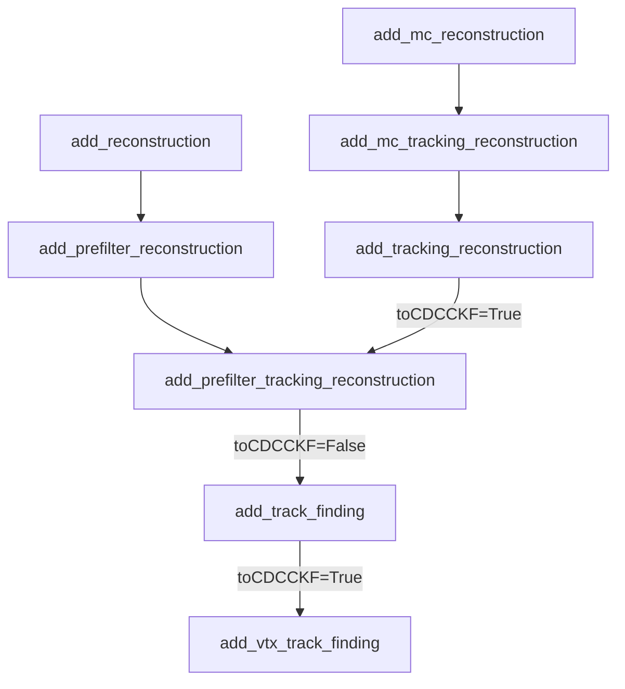

# BBar
This directory includes efficiency and resolution studies of using
`Upsilon(4S) -> B0 anti-B0` events. Each event contains one _generic B_, which
uses the default decay table, and one _signal B_, which only decays with
`B0 -> D*- mu+ nu_mu` (order 5% of the decay width in the real world). The
_signal B_ is the `B0` 50% of the times, the `anti-B0` the other 50%.

The `D*`s are set to only decay with `D*+ -> D0 pi+` (67% of the decay width in
the real world).

The `D0`s are set to decay with this table
```
D0 -> K- pi+          32.43%
D0 -> K- pi+ pi+ pi-  67.57%
```
The branching fractions are normalized, but these two actually make up only
12.18% of the total decay width (source: PDG, of course).

Steering files for generation, simulation, reconstruction (everything that has
to be done using basf2) in `steering/`. Offline (i.e. non-basf2-based) analysis
in `offline/`.

## Tracking flow for `Upgrade`

